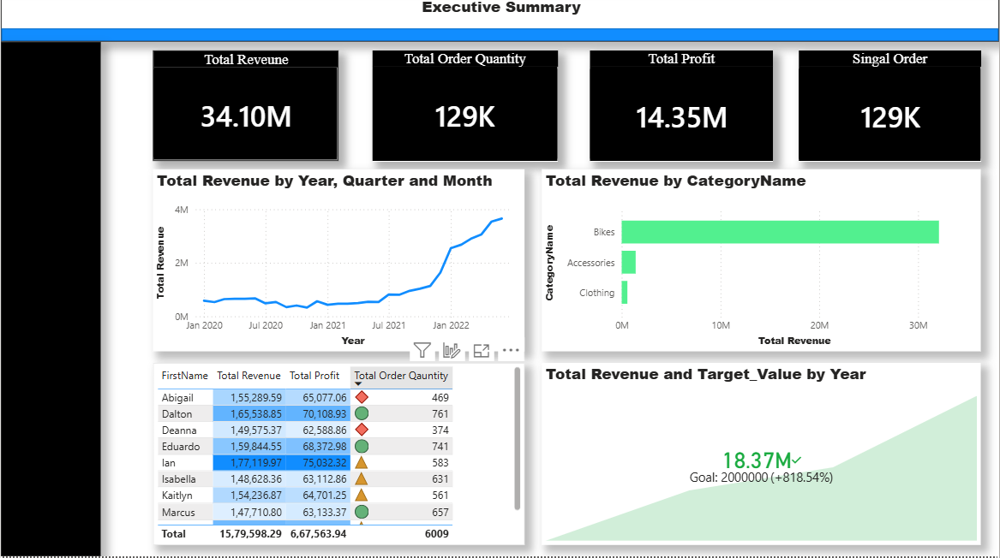
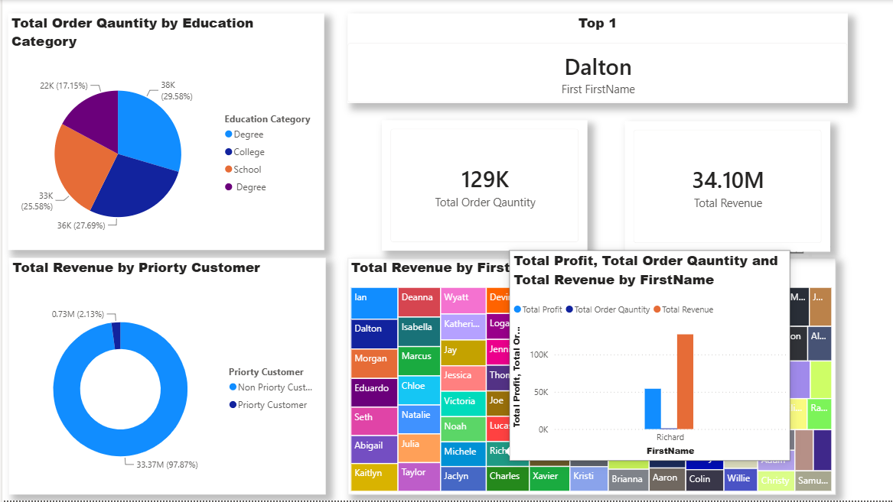
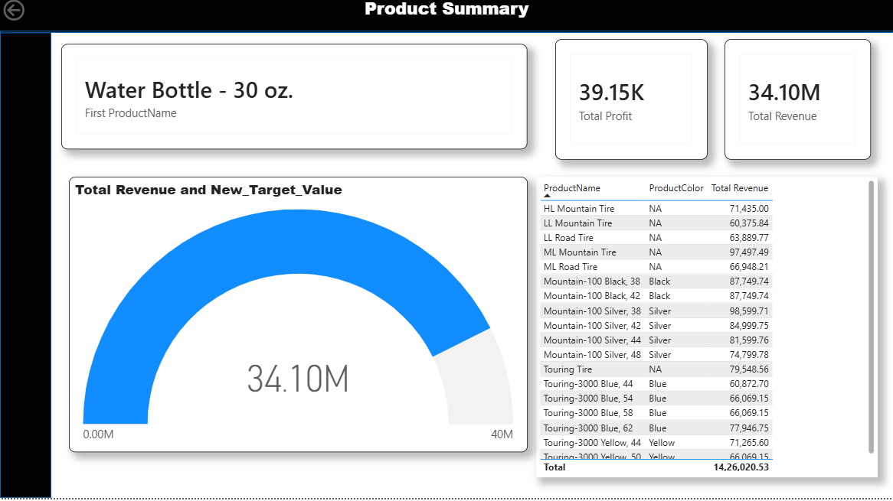

# 📊 Sales & Customer Analytics Dashboard | Power BI

An interactive **Sales & Customer Analytics Dashboard** developed using **Microsoft Power BI** to analyze business performance across revenue, profit, orders, customers, products, and categories.

The project transforms sales and customer data into an interactive business intelligence solution with KPI tracking, customer analysis, product-level analysis, time-based trends, category performance, and target comparison.

---

## 📌 Project Overview

This Power BI project focuses on understanding how sales performance varies across:

- Revenue
- Profit
- Order quantity
- Customers
- Products
- Product categories
- Customer education categories
- Priority customer segments
- Time periods
- Product attributes such as color and product name

The dashboard is designed to provide both **high-level business performance monitoring** and **detailed customer/product analysis**.

---

# 🎯 Project Objectives

The main objectives of this project are to:

- Monitor overall sales performance using key KPIs
- Analyze revenue and profit trends over time
- Identify high-performing product categories
- Analyze customer-level revenue and order performance
- Identify top customers based on business metrics
- Compare performance across customer segments
- Analyze product-level revenue and profitability
- Compare actual revenue with a defined target
- Present complex business data through interactive Power BI visuals

---

# 📊 Dashboard Preview

## 1. Executive Summary

The **Executive Summary** provides a high-level view of overall business performance.

It includes:

- Total Revenue
- Total Order Quantity
- Total Profit
- Revenue trend by Year, Quarter and Month
- Revenue by Category
- Customer-level Revenue, Profit and Order Quantity
- Revenue and Target Value comparison

### Key KPIs

| KPI | Dashboard Value |
|---|---:|
| Total Revenue | **34.10M** |
| Total Order Quantity | **129K** |
| Total Profit | **14.35M** |
| Single Order | **129K** |

### Dashboard Screenshot



### Key Observations

- The dashboard reports **34.10M in total revenue**.
- Total order quantity is approximately **129K**.
- Total profit is approximately **14.35M**.
- Revenue is analyzed across **Year, Quarter and Month** to understand changes over time.
- The **Bikes** category contributes the largest share of revenue compared with Accessories and Clothing.
- Customer-level analysis combines revenue, profit and order quantity for comparison.
- A target comparison visual displays revenue against a **20M target value**.

---

# 2. Customer Analysis

The **Customer Analysis** page focuses on understanding customer purchasing behavior and revenue contribution.

The page includes:

- Order quantity by Education Category
- Top customer identification
- Total Order Quantity
- Total Revenue
- Revenue by Priority Customer
- Revenue by individual customer
- Customer-level comparison of Profit, Revenue and Order Quantity

### Dashboard Screenshot



### Key Analysis

#### Education Category

Customer order quantity is distributed across different education categories, including:

- Degree
- College
- School

The dashboard allows comparison of order quantity across these customer groups.

#### Priority Customer Analysis

The dashboard compares revenue generated by:

- Priority Customers
- Non-Priority Customers

The displayed analysis shows that the majority of revenue comes from the **Non-Priority Customer** segment.

#### Top Customer

The dashboard identifies individual customers based on the selected ranking logic. In the displayed view, **Dalton** appears as the top customer.

#### Customer-Level Performance

Customer performance can be compared using:

- Total Revenue
- Total Profit
- Total Order Quantity

This helps identify customers contributing significantly to overall business performance.

---

# 3. Product Summary

The **Product Summary** page provides detailed product-level analysis.

It includes:

- Product-level revenue
- Product name
- Product color
- Total Revenue
- Total Profit
- Revenue and target comparison
- Product ranking/selection
- Detailed product table

### Dashboard Screenshot



### Key Analysis

The product dashboard allows users to examine individual products and compare their revenue contribution.

The displayed view includes products such as:

- HL Mountain Tire
- LL Mountain Tire
- LL Road Tire
- ML Mountain Tire
- ML Road Tire
- Mountain-100 variants
- Touring Tire
- Touring-3000 variants
- Water Bottle - 30 oz.

The dashboard also provides product attributes such as **Product Name** and **Product Color**.

The selected product view can be used to examine product-specific revenue and profitability.

---

# 📈 Business Metrics Analyzed

The dashboard focuses on the following major metrics:

### Revenue

Used to understand overall sales performance and compare revenue across:

- Time periods
- Product categories
- Customers
- Products

### Profit

Used to understand the profitability associated with sales and customers.

### Order Quantity

Used to analyze sales volume and customer purchasing activity.

### Target Value

Used to compare actual revenue against a defined target.

---

# 🔍 Data Analysis Performed

The project includes analysis across multiple dimensions.

### Time-Based Analysis

Revenue is analyzed by:

- Year
- Quarter
- Month

This provides visibility into changes in business performance over time.

### Category Analysis

Revenue is compared across product categories such as:

- Bikes
- Accessories
- Clothing

### Customer Analysis

Customers are analyzed based on:

- Revenue
- Profit
- Order Quantity
- Education Category
- Priority Customer status

### Product Analysis

Products are analyzed based on:

- Product Name
- Product Color
- Revenue
- Profit

---

# 🛠️ Tools & Technologies

### Microsoft Power BI

Used to build the interactive dashboard, data model, KPIs, charts, tables and business visualizations.

### Power Query

Used for data preparation and transformation before analysis.

### DAX

Used to create analytical calculations and measures for KPIs and dashboard visualizations.

### Data Modeling

Used to organize relationships between customer, product and sales-related data.

---

# 📚 Power BI Concepts Demonstrated

This project demonstrates practical knowledge of:

- Power BI Desktop
- Power Query
- Data Cleaning
- Data Transformation
- Data Modeling
- Relationships
- DAX Measures
- Calculated Columns
- KPI Cards
- Tables
- Bar Charts
- Line Charts
- Donut Charts
- Treemap Visualizations
- Gauge / Target Visualizations
- Conditional Formatting
- Time-Based Analysis
- Customer Segmentation
- Product Analysis
- Interactive Report Pages
- Tooltips
- Dashboard Navigation

---

# 📂 Dashboard Pages

The Power BI report contains multiple report pages, including:

| Page | Purpose |
|---|---|
| **Executive Summary** | Overall business performance and KPIs |
| **Customer Analysis** | Customer behavior and revenue analysis |
| **Product Summary** | Product-level performance analysis |
| **Executive Map** | Supporting geographic/business analysis |
| **Tooltip** | Interactive supporting visual information |

---

# 💡 Business Insights

The dashboard can be used by business and management teams to:

- Monitor overall revenue and profitability
- Identify important revenue-generating categories
- Track order volume
- Compare customer segments
- Identify high-value customers
- Analyze product performance
- Compare revenue across products
- Monitor changes in revenue over time
- Compare actual performance against a target

---

# 📁 Repository Contents

```text
sales-customer-analytics-powerbi/
│
├── PowerBI_Project.pbix
├── README.md
│
├── Screenshot 2026-09-16 234451.png
├── Screenshot 2026-09-16 234523.png
└── Screenshot 2026-09-16 234549.png
PowerBI_Project.pbix

The complete Power BI report containing the data model, transformations, calculations, visualizations and dashboard pages.

Dashboard Screenshots

The PNG files provide a quick preview of the Power BI dashboard directly from GitHub without requiring Power BI Desktop.

▶️ How to Use the Project
Download PowerBI_Project.pbix from this repository.
Install Microsoft Power BI Desktop.
Open the .pbix file.
Navigate through the dashboard pages.
Explore the visualizations and available filters/interactions.
Use the customer and product analysis pages for detailed analysis.

Note: The .pbix file needs Power BI Desktop to be opened and explored interactively. GitHub displays the screenshots as the visual preview of the project.

🎓 Skills Demonstrated

This project demonstrates practical skills relevant to entry-level:

Data Analyst
Business Intelligence Analyst
Power BI Developer
Reporting Analyst
MIS Analyst
Business Analyst
Technical Skills

Power BI | Power Query | DAX | Data Visualization | Data Modeling | Data Analysis | KPI Reporting

👩‍💻 Author
Vaishnavi Mirge

B.E. Computer Science Engineering

📍 Pune, Maharashtra, India

Connect With Me
GitHub: Vaishnavimirge
LinkedIn: Vaishnavi Mirge
